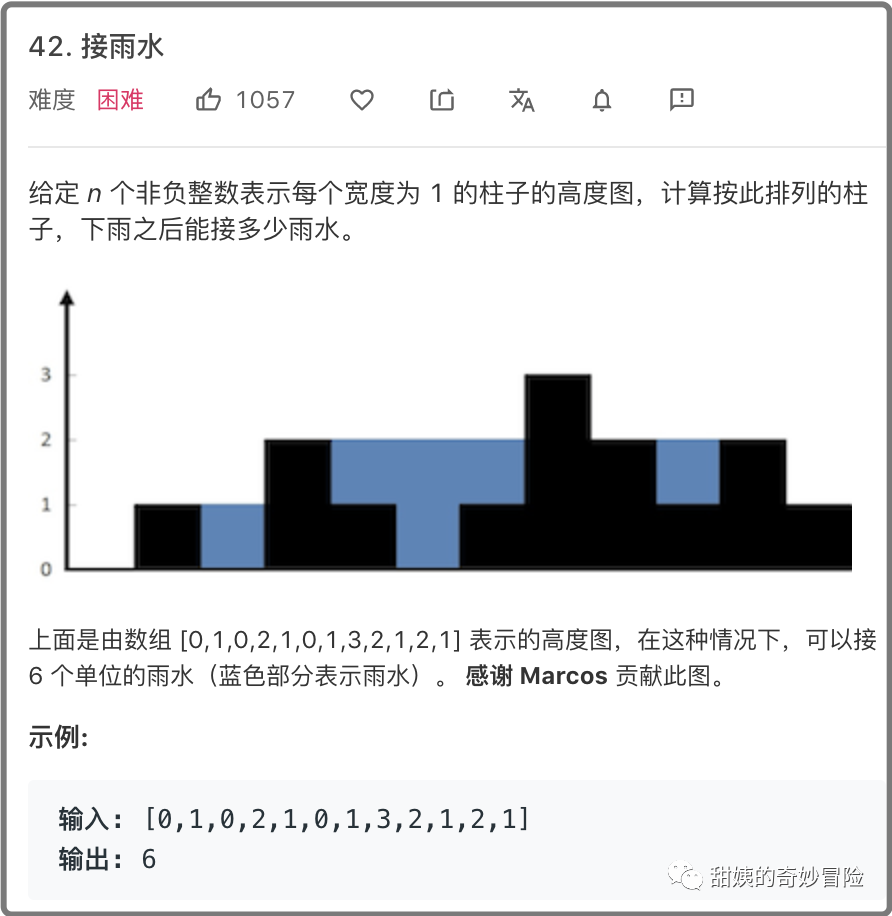
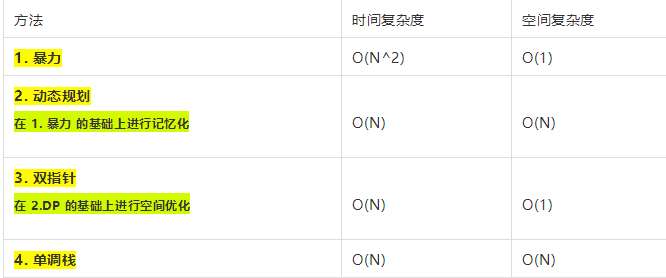
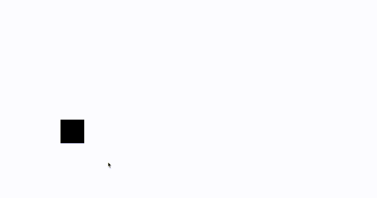
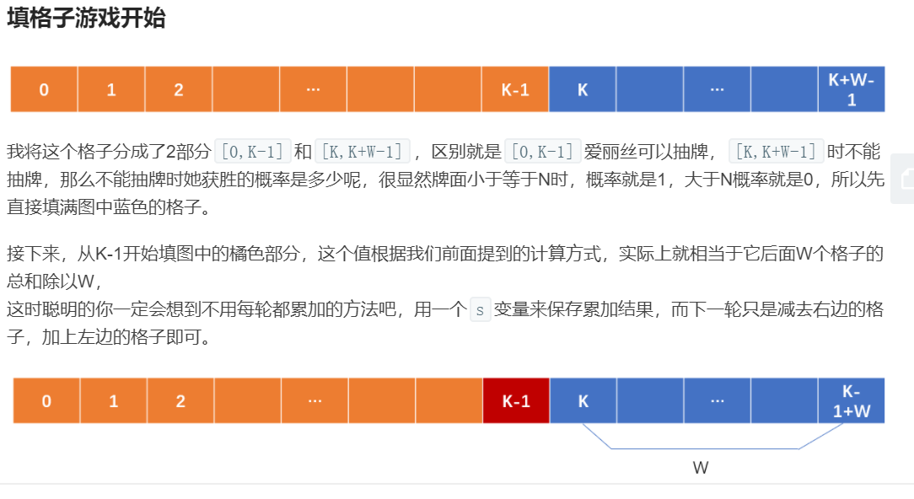

### 46-接雨水





#### 1 暴力解法

很明显**每个柱子**顶部可以储水的高度为：**该柱子的左右两侧最大高度的较小者减去此柱子的高度**。

因此我们只需要遍历每个柱子，累加每个柱子可以储水的高度即可。

此方法非常好理解，直接看下述👇代码中的注释即可。

```java
//暴力解法,由于要遍历没一个柱子,而且要确定左右两边最小值
    //故O(n^2)
    public int trapTheWater(int[] height){
        int res=0;
        //首尾不能存雨水,故从 [1,length-2]
        for(int i=1;i<height.length-1;i++){
            //每个柱子能存的水等于  左右两侧最大高度的差值-当前柱子高度
            //leftMax和rightMax记录着左边最高的值和右边最高的值
            int leftMax=0,rightMax=0;
            //找到左边的最大值
            for(int j=i;j>=0;j--)
                if(leftMax<height[j])
                    leftMax=height[j];
            //找到右边的最大值
            for(int j=i;j<height.length-1;j++)
                if(rightMax<height[j])
                    rightMax=height[j];
            //该柱子所存的水为,min-heigh[i];
            int min = Math.min(leftMax, rightMax);
                res+=(min-height[i]);
        }
        return  res;
    }
```

#### 2 动态规划

在上述的暴力法中，对于每个柱子，我们**都需要从两头重新遍历**一遍求出左右两侧的最大高度，这里是有很多重复计算的，很明显**最大高度是可以记忆化的**，具体在这里可以用数组边递推边存储，也就是常说的动态规划，DP。

```java
 public  int trapTheWater2(int[] height){
        /**
         * 定义二维数组 dp[n][2]
         * 其中dp[i][1]表示i左边高的最大值
         * 其中dp[i][2]表示i右边高的最大值
         * 分别从两头遍历height数组,填写dp[i][j]
         */
        int n=height.length;
        if(n==0)
            return 0;
        int[][] dp=new int[n][2W];
        //dp[i][0]表示i左边的最大值
        //dp[i][1]表示i右边的最大值
        dp[0][0]=height[0];
        dp[n-1][1]=height[n-1];
        for(int i=1;i<n;i++){
            //dp[i-1][0]--->i-1处左边的最大高度
           dp[i][0]=Math.max(dp[i-1][0],height[i]);
        }
        for(int i=n-2;i>=0;i--){
            dp[i][1]=Math.max(height[i],dp[i+1][1]);
        }
        //最终dp绘制完成,累加res
        int res=0;
        for(int i=1;i<n-1;i++){
            res+=Math.min(dp[i][0],dp[i][1] )-height[i];
        }
        return  res;
    }
```

#### 3 双指针

在上述的动态规划方法中，我们用二维数组来存储每个柱子左右两侧的最大高度，但我们递推累加每个柱子的储水高度时其实只用到了`dp[i][0]`和 `dp[i][1]` 两个值，因此我们递推的时候只需要用`int leftMax `和 `int rightMax` 两个变量就行了。

即将上述代码中的递推公式：

`res += Math.min(dp[i][0], dp[i][1]) - height[i];`

优化成：

`res += Math.min(leftMax, rightMax) - height[i];`

注意这里的 `leftMax `是从左端开始递推得到的，而 `rightMax `是从右端开始递推得到的。

因此遍历每个柱子，累加每个柱子的储水高度时，也需要用 left 和 right 两个指针从两端开始遍历。

```java
public int trapTheWater(int[] height){
    int left=0,right=0,leftMax=0,rightMax=0;
    int res=0;
    while(left<=right){
        if(leftMax<=rightMax){
             leftMax=Math.max(leftMax,height[left]);
             res+=leftMax-height[left++];
        }
        else{
            rightMax=Math.max(rightMax,height[right]);
            res+=rightMax-height[right--];
        }
       
    }
    return res;
}
```

#### 4 单调栈



```java
  public int trap(int[] height) {
        Stack<Integer> stack = new Stack<>();
        int res = 0;
        // 遍历每个柱体
        for (int i = 0; i < height.length; i++) {
           while (!stack.isEmpty() && height[stack.peek()] < height[i]) {
                int bottomIdx = stack.pop();
                // 如果栈顶元素一直相等，那么全都pop出去，只留第一个。
                while (!stack.isEmpty() && height[stack.peek()] == height[bottomIdx]) {
                    stack.pop();
                }
                if (!stack.isEmpty()) {
                    // stack.peek()是此次接住的雨水的左边界的位置，右边界是当前的柱体，即i。
                    // Math.min(height[stack.peek()], height[i]) 是左右柱子高度的min，减去height[bottomIdx]就是雨水的高度。
                    // i - stack.peek() - 1 是雨水的宽度。
                    res += (Math.min(height[stack.peek()], height[i]) - height[bottomIdx]) * (i - stack.peek() - 1);
                }
            }
            stack.push(i);
        }
        return res;
    }
```

----

### 64-计算前n的和(不用for)

#### 64-1 等差数列公式

```java
class Solution {
    public int sumNums(int n) {
        return n*1+n*(n-1)/2;
    }
}
```

#### 64-2 递归

```java
class Solution{
    public int sumNums(int n){
        int sum=n;
        boolean flag=n>0&&sum+=sumNums(n-1)>0;
        return sum;
    }
}
```
### 238- 求除了自己之外的数组的乘积

> 给你一个长度为 n 的整数数组`nums` ，其中 n > 1，返回输出数组 output ，其中 output[i] 等于`nums` 中除 `nums[i]` 之外其余各元素的乘积。

```
输入: [1,2,3,4]
输出: [24,12,8,6]
```

#### 方法一:两个dp数组

```java
class Solution {
    public int[] productExceptSelf(int[] nums) {
         //前缀之乘积dp数组
        int[] front=new int[nums.length];
        //后缀之乘积dp数组
        int[] rear=new int[nums.length];
        //构造前缀dp
        front[0]=1;
        for(int i=1;i<front.length;i++)
            front[i]=front[i-1]*nums[i-1];
        //构造后缀dp
        rear[nums.length-1]=1;
        for(int i=nums.length-2;i>=0;i--)
            rear[i]=rear[i+1]*nums[i+1];
        int[] ans=new int[nums.length];
        for(int i=0;i<ans.length;i++)
            ans[i]=front[i]*rear[i];
        return  ans;
    }
}
```

#### 方法二 一个dp数组,白嫖ans

```java
public  int[] productExceptSelf2(int[] nums){
    	//输出的数组,不需要前缀数组了
        int[] ans=new int[nums.length];
        //后缀之乘积dp数组
        int[] rear=new int[nums.length];
        //构造前缀dp
        ans[0]=1;
        for(int i=1;i<ans.length;i++)
            ans[i]=ans[i-1]*nums[i-1];
        //构造后缀dp
        rear[nums.length-1]=1;
        for(int i=nums.length-2;i>=0;i--)
            rear[i]=rear[i+1]*nums[i+1];

        for(int i=0;i<ans.length;i++)
            ans[i]=ans[i]*rear[i];
        return  ans;
    }java
```

#### 方法三  循环迭代数组,而不需要存储

```java
/**
     * 常数空间复杂度,最优解
     * @param nums
     * @return
     */
    public int[] productExceptSelf3(int[] nums){
        int front =1,rear=1,ans[]=new int[nums.length];
        //迭代更新front,
        for(int i=0;i< nums.length;i++){
            ans[i]=front;
            front=front*nums[i];
        }
        for(int i=nums.length-1;i>=0;i--){
            ans[i]=ans[i]*rear;
            rear=rear*nums[i];
        }
        return  ans;
    }
```


### 827-求爱丽丝21点的胜率

#### 解题思路

> 爱丽丝参与一个大致基于纸牌游戏 “21点” 规则的游戏，描述如下：
>
> 爱丽丝以 0 分开始，并在她的得分少于 K 分时抽取数字。 抽取时，她从 [1, W] 的范围中随机获得一个整数作为分数进行累计，其中 W 是整数。 每次抽取都是独立的，其结果具有相同的概率。
>
> 当爱丽丝获得不少于 K 分时，她就停止抽取数字。 爱丽丝的分数不超过 N 的概率是多少？



```java
package leetcode827_21points;

import java.util.Random;

/**
 * 爱丽丝参与一个大致基于纸牌游戏 “21点” 规则的游戏，描述如下：
 * <p>
 * 爱丽丝以 0 分开始，并在她的得分少于 K 分时抽取数字。 抽取时，她从 [1, W] 的范围中随机获得一个整数作为分数进行累计，其中 W 是整数。 每次抽取都是独立的，其结果具有相同的概率。
 * <p>
 * 当爱丽丝获得不少于 K 分时，她就停止抽取数字。 爱丽丝的分数不超过 N 的概率是多少？
 */
public class NewTwentyOnePoints {
    /**
     * 定义dp[x]--->代表手上分数为x时,赢游戏的概率
     *
     * @param N
     * @param K
     * @param W
     * @return
     */
    public double new21Game(int N, int K, int W) {
        //当手上的分数为K-1的时候,如果此时 K-1+W<N---一定能赢比赛
        if (K - 1 + W <= N)
            return 1.0;
        //当分数为[K,N]的时候赢得游戏概率为1.0
        double[] dp = new double[K + W];
        for (int i = K; i <= N; i++)
            dp[i] = 1.0;
        //后边数组为1.0的个数一共有 N-K+1;
        //故 初始的dp[K-1]=(N-K+1)*1.0/W;
        double sumIncidence = N - K + 1;
        for (int i = K - 1; i >= 0; i--) {
            //依次填写分数为[0,K-1]时赢的概率
            /*
             * 对于dp[i]=sum(dp[i+1]...dp[i+W])/W
             * 每一轮迭代,修改sumIncidence,每一轮减去上一轮末尾的dp,也就是dp[];
             * */
            dp[i] = sumIncidence / W;
            sumIncidence = sumIncidence + dp[i]-dp[i+W];
        }
        return  dp[0];

    }
}

```


